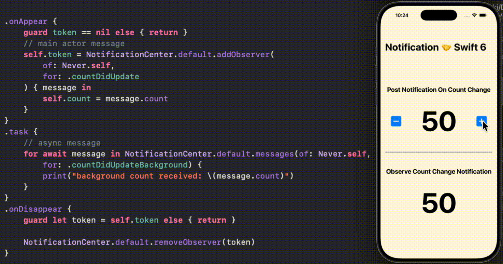

# Swift_NotificationCenter-Swift6

A demo of implementing type safe concurrency safe Notification Center messages introduced in swift 6.2.

- NotificationCenter.MainActorMessage for notification messages that we want to receive on the main thread, and 
- NotificationCenter.AsyncMessage for background messages and asynchronous observations.

For more details, please check out my blog [Swift Notifications Evolved Again: Type Safe, Concurrency Safe Messages!]()

